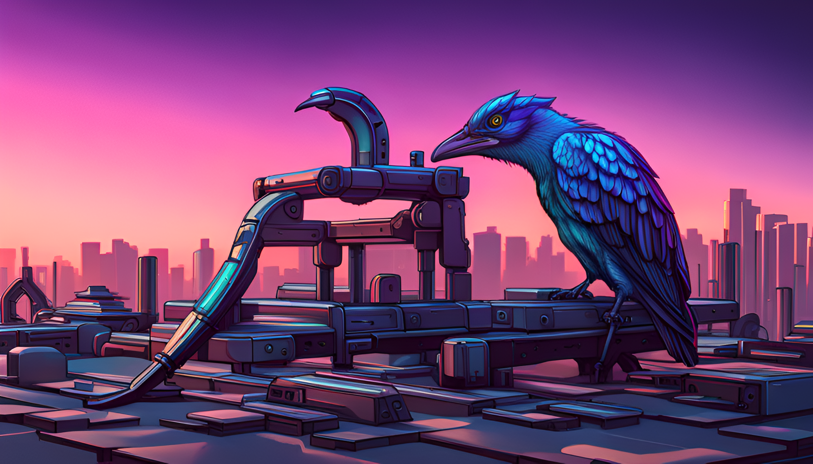

Here's something I had to learn the hard way in my career: just because you're busy, it doesn't mean that you're getting things done. In fact, computers make this a thousand times worse: you can burn through *years* of your work-life without getting anything done at all.

Let's track back a little bit. In [Bullshit Jobs](https://en.wikipedia.org/wiki/Bullshit_Jobs) one of David Graeber's main questions was: if computers made so many tasks obsolete, how come there hasn't been a huge wave of unemployment? His main answer was a hypothesised rise of 'bullshit jobs', weirdly pointless jobs that are mostly there so the upstairs people can tell each other how many people their respective departments have, and how much work is getting done by all these people.

While I agree with most of that, I don't think it's the only reason. Here's another one: computers, *especially big computers*, create an illusion of work. The bigger the computer, the bigger the illusion. We're all falling into this trap of fake-business, but it's not George-Costanza-faking-an-angry-face-fake-busy, but honestly-believing-we're-doing-lots-of-work-fake-busy.

Here's one example from my research career in bioinformatics: we often have to index large databases, usually on a high-performance computer (HPC). These index jobs take several hundred gigabytes of memory, but the HPC-admins need to consider everyone's needs, so your job can only run for up to 24 hours. Sometimes my jobs would run out of time and get killed by the cluster. I checked the job, fiddled with some parameters, resubmitted, and 24 hours the job would die again. Fiddled again, did other stuff for a day, ran out of walltime again, died again. A phoenix rising and dying and rising and dying.

 
Before I knew it, weeks had gone by, I had vaguely felt like I was doing stuff, but the truth was: nothing actually had moved forward. I was kidding myself. Computational people especially fall easily into this trap: we don't have to stand in a lab, we don't waste expensive reagents, we don't kill animals. We only burn electricity in some faraway computing center. We can always fiddle with some parameter, or try this other approach, or rerun the crashed job. Especially in academia it's easy to fall into this trap, as there are no project management structures, nobody *really* checks what you're doing. But to us, it still feels like we're busy! The proof is that our HPC allocation is getting eaten up.

The solution: In my postdoc days I started a regular postdoc-meeting with my supervisor and the other postdoc to go over every single PhD-student's project. Had we made progress? Were we just kidding ourselves? Always asking: if this task is stuck, does this task have to be done in the first place? Can it be done in a different way? Do we even need the question this task is trying to answer? Especially less experienced people like PhD students never ask these questions; there are nervous, they want results as soon as possible, they don't have time to take a step back and just look at what they're trying to do. That takes time, experience, and quiet.

In my new job in 'industry' it's far better, as there are better reporting structures. Yes there are far more meetings, but that also means that 'fake' progress gets detected far faster: if there is work happening why are there no results? What is blocked?

So beware the illusion of working hard when you're churning through your local cluster's SUs: chances are you're doing nothing at all.

----

I'm always happy to hear feedback over on [Mastodon](https://genomic.social/@PhilippBayer/)!

All images generated using DreamStudio. Prompts: 'An abandoned church full of computers and monitors, dust everywhere.' and 'a cyberpunk bird looking tired'
